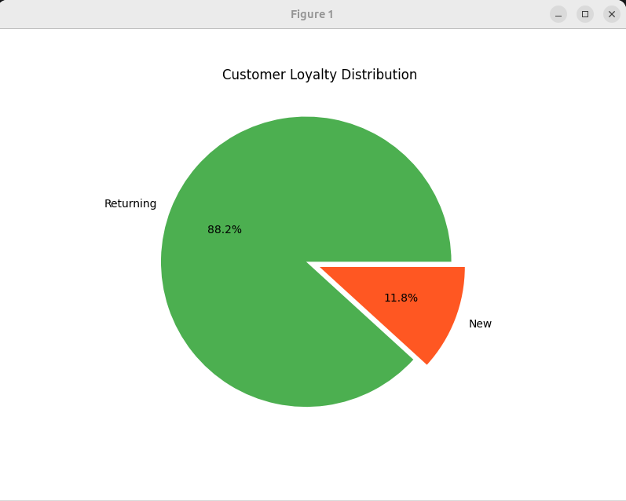
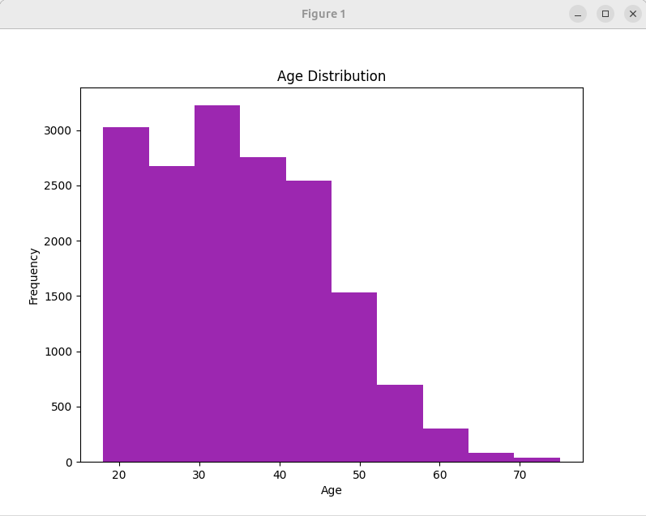
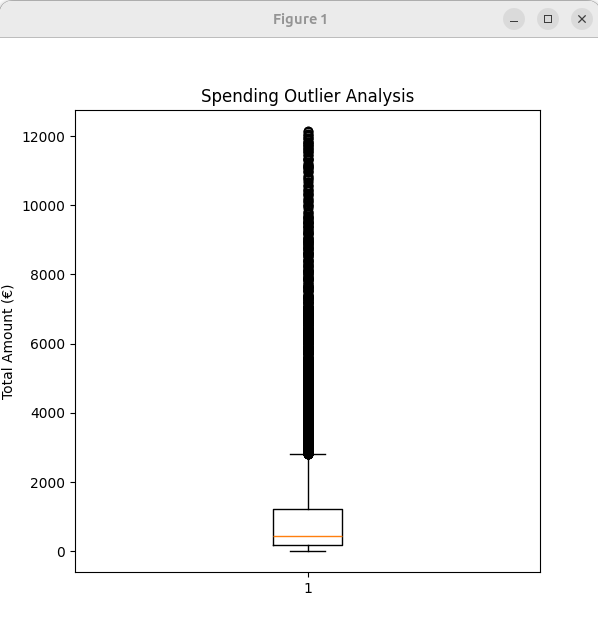
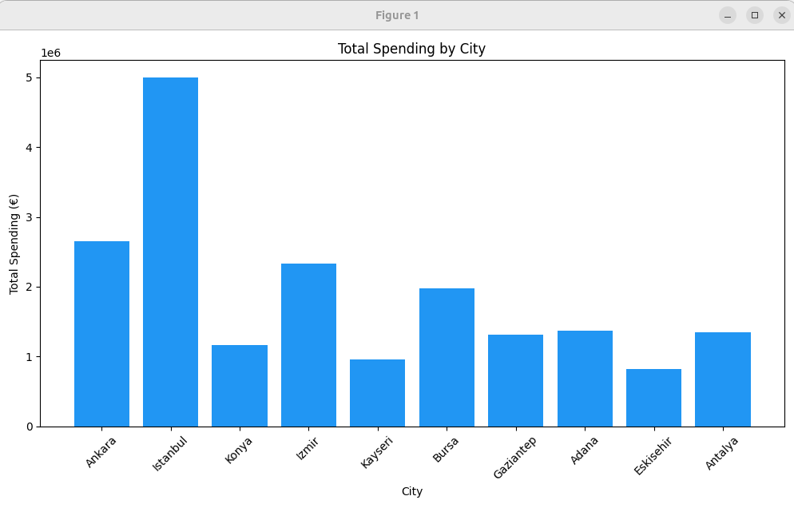

# E-commerce Customer Behavior Analysis

**Python Version:** 3.12  

---

## 🇩🇪 Deutsch

### Beschreibung
Dieses Projekt analysiert das Verhalten von E-Commerce-Kunden anhand eines CSV-Datensatzes. Ziel ist es, Loyalitätsmuster zu erkennen, potenzielle Abwanderung (Churn) zu identifizieren und grundlegende Kundenprofile zu analysieren.

Das Projekt umfasst:
* Datenbereinigung und -vorverarbeitung (Data Cleaning)
* Explorative Datenanalyse (EDA)
* Datenvisualisierung zur Unterstützung von Entscheidungsprozessen

---

### Technologien & Fähigkeiten
* **Python (OOP):** Objektorientierte Modellierung von Kundendaten
* **Pandas & NumPy:** Datenverarbeitung und Analyse
* **Data Cleaning:** Umgang mit Duplikaten, fehlenden Werten und Ausreißern
* **Explorative Datenanalyse (EDA):** Statistische Auswertung von Kundendaten
* **Matplotlib:** Erstellung von Visualisierungen

---

## 🇬🇧 English

### Description
This project analyzes e-commerce customer behavior using a structured CSV dataset. The goal is to identify loyalty patterns, detect potential churn behavior, and understand core customer profiles.

The project includes:
* Data cleaning and preprocessing
* Exploratory Data Analysis (EDA)
* Data visualization for business insights

---

### Technologies & Skills
* **Python (OOP):** Object-oriented customer modeling
* **Pandas & NumPy:** Data manipulation and analysis
* **Data Cleaning:** Handling missing values, duplicates, and outliers
* **Exploratory Data Analysis (EDA):** Statistical insights from customer data
* **Matplotlib:** Data visualization

---

## 📊 Visualizations

### Customer Loyalty & Age Distribution
<p align="center">
  
  
</p>

### Spending Analysis & Regional Insights
<p align="center">
  
  
</p>

---

## Project Structure

* **Customer Class** → Represents individual customers as structured objects  
* **ChurnAnalyzer Class** → Handles data loading, filtering, and statistics  
* **Data Cleaning Pipeline** → Removes duplicates, handles missing values, and filters outliers (99th percentile)  
* **Output** → Console-based statistics and Matplotlib visualizations  

---

## Dataset
The dataset includes the following features:

`Order_ID`, `Customer_ID`, `Age`, `Gender`, `City`, `Total_Amount`, `Is_Returning_Customer`, `Customer_Rating`

**Data Source:** 5,000 Turkish e-commerce transactions  
See [`DATA_INFO.md`](./data/raw/DATA_INFO.md) for detailed schema information.

---

## ⚙️ Installation & Execution

```bash
# 1. Clone the repository
git clone https://github.com/SiamakGoudarzi/python-portfolio.git

# 2. Navigate to the project folder
cd E-commerce-Customer-Behavior-Analysis

# 3. Install dependencies
pip install pandas matplotlib numpy

# 4. Run the script
python customer_analysis.py

